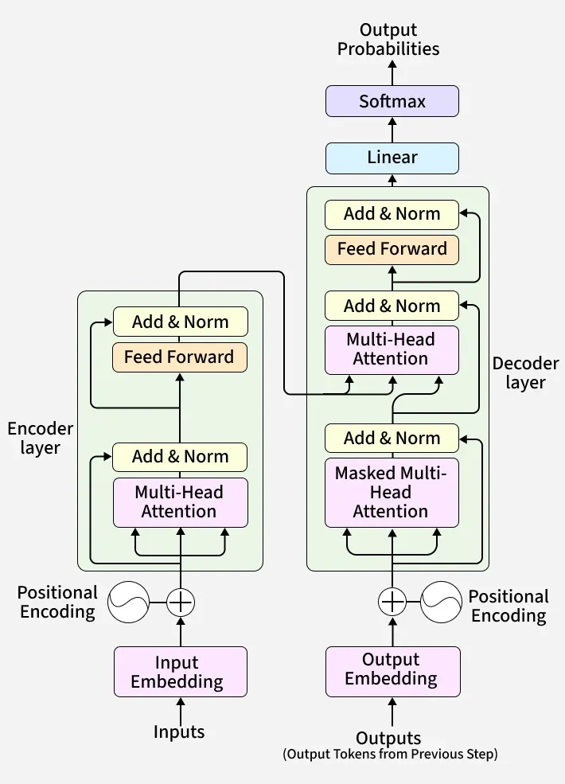

# ⚡ PyTorch Transformer for Neural Machine Translation


A clean, modular, and highly optimized implementation of the original [Attention Is All You Need](https://arxiv.org/abs/1706.03762) Transformer model built completely from scratch in PyTorch. 

Currently configured for **English (en) ➞ Gujarati (gu)** translation using the `Helsinki-NLP/opus-100` dataset, but elegantly structured so it can be adapted to *any* language pair or sequence-to-sequence task.

---

## ✨ Features

- **Built from Scratch**: Full PyTorch implementation of Multi-Head Attention, Encoder/Decoder stacks, and Positional Encodings. No black-box Transformer libraries.
- **Optimized Training**: Supports Automatic Mixed Precision (AMP) and Gradient Accumulation to maximize hardware efficiency on consumer GPUs.
- **Custom Tokenizer**: Dynamically trains a WordLevel tokenizer (via HuggingFace `tokenizers`) directly on your dataset.
- **Real-time Monitoring**: Integrated with TensorBoard for tracking loss curves and visualization.
- **Data Analytics**: Includes a utility script (`analyze_seq_len.py`) to analyze sequence length percentiles to find the optimal padding and sequence configuration.
- **Greedy Decoding**: Real-time inference implemented in the validation loop to preview translations as the model learns.
- **Interactive Interfaces (CLI & GUI)**: Includes a command-line interface for translation and a web-based GUI to interactively visualize encoder, decoder, and cross-attention matrices!

## 🧠 Architecture Overview

This project mirrors the classical Seq2Seq Transformer architecture.

<p align="center">
  
</p>

## 📂 Project Structure

```text
transformer/
├── model.py            # Core Transformer architecture (Attention, Encoder, Decoder)
├── dataset.py          # PyTorch Dataset, tokenization, and causal masking logic
├── train.py            # Training loop, AMP, validation, and TensorBoard logging
├── config.py           # Centralized hyperparameter and dataset configuration
├── analyze_seq_len.py  # Utility to calculate optimal max sequence lengths
├── README.md           # Project documentation
├── requirements.txt    # Standard pip dependencies
└── pyproject.toml      # Dependency management configuration
```

## 🚀 Getting Started

### 1. Prerequisites

Ensure you have Python 3.9+ and PyTorch installed. It is recommended to use `uv` or a standard virtual environment.

```bash
# Clone the repository
git clone https://github.com/your-username/transformer.git
cd transformer

# Activate your virtual environment (e.g., using uv)
uv venv
# On Windows: .venv\Scripts\activate
# On Unix: source .venv/bin/activate

# Install dependencies
uv pip install -r requirements.txt
```

### 2. Configuration

All hyperparameters and language settings are centralized in `config.py`. 
Modify the language pair, batch size, learning rate, sequence length, and model dimensions here.

```python
# config.py (Snippet)
"batch_size": 64,
"num_epochs": 20,
"seq_len": 100, 
"d_model": 512,
"lang_src": "en",
"lang_tgt": "gu",
```

### 3. Analyze Sequence Lengths (Optional but Recommended)

Before training, run the analytics script to see the length distribution of your dataset. This helps you set a memory-efficient `seq_len` in `config.py` without truncating too much data.

```bash
python analyze_seq_len.py
```

### 4. Train the Model

Start the training loop. The script will automatically download the dataset from HuggingFace, build the required tokenizers, and begin training. Model weights are saved at the end of every epoch in the `weights/` folder.

```bash
python train.py
```

*Note: To resume training from a specific epoch, set the `"preload"` key in `config.py` to the epoch number (e.g., `"07"`).*

### 5. Monitor Training

Watch the loss decrease in real-time by opening TensorBoard in a separate terminal:

```bash
tensorboard --logdir=runs
```

### 6. Interactive CLI Translation

Once you have a trained model in the `weights/` directory, you can translate text directly in your terminal using the interactive CLI:

```bash
python main.py
```

### 7. Web GUI & Attention Visualization

To use the web-based GUI, which provides translation and **visualizations for encoder, decoder, and cross-attention matrices**:

```bash
python app.py
```

Open your browser and navigate to `http://localhost:8080`. Type in a sentence to translate and view the detailed attention maps for each layer!

---

## 🛠️ Customization

To train a different language pair:
1. Change `lang_src` and `lang_tgt` in `config.py`.
2. Ensure the language pair exists in the [Helsinki-NLP/opus-100](https://huggingface.co/datasets/Helsinki-NLP/opus-100) dataset on HuggingFace.
3. Start training! The codebase will automatically handle the creation of new tokenizers for your new languages.

## 📝 License

Distributed under the MIT License. See `LICENSE` for more information.

